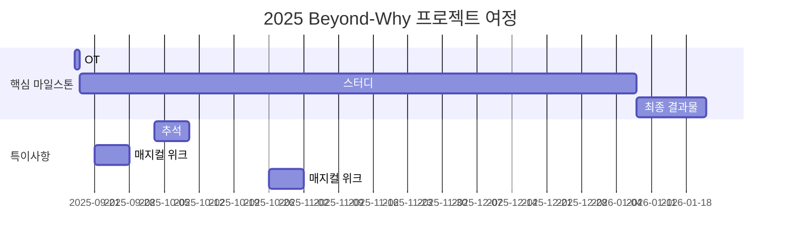

# ？Beyond-Why

<h1 align="center"> Beyond-Why </h1>

<div align="center">
<a href="https://pseudo-lab.com"></a>
<a href="https://discord.gg/EPurkHVtp2"></a>
<a href="https://github.com/Pseudo-Lab/10th-template/stargazers"></a>
<a href="https://github.com/Pseudo-Lab/10th-template/network/members"></a>
<a href="https://github.com/Pseudo-Lab/10th-template/pulls"></a>
<a href="https://github.com/Pseudo-Lab/10th-template/issues"></a>
<a href="https://github.com/Pseudo-Lab/10th-template/graphs/contributors"></a>
</div>
<br>

<!-- sheilds: https://shields.io/ -->
<!-- hits badge: https://hits.seeyoufarm.com/ -->

> Beyond-Why Repository에 오신 것을 환영합니다!
우리는 인과추론(causal inference)을 학습하고, 더 나아가 데이터 실무자를 위한 실질적인 가이드라인과 체크리스트를 만드는 것을 목표로 합니다.
협력적인 학습과 열린 토론을 통해 인과추론 분야를 함께 발전시켜 나가요.   
<br/>
<br/>

🚀 Beyond Why — 가짜연구소 11기 인과추론 연구 및 활용 프로젝트
- Why, 그 너머를 탐구하고 실제 현실에서 활용할 수 있는 방법을 연구합니다.
<br/>

## 🌟 프로젝트 목표 (Project Vision)
- “이론에서 실전까지: 인과추론 학습에서 실무 적용까지”
- 《실무로 통하는 인과추론 with 파이썬》(한빛미디어) 교재 기반 학습 (총 19주, 실제 프로젝트 기간은 16주)
- 매주 학습 → 정리 → 토론을 통해 개인별 지식 축적
- 최종적으로 실무 적용을 위한 체크리스트 및 가이드라인 제작
- 오픈소스 정신을 바탕으로 산출물 GitHub/Notion 공개
- 실무형 인과추론 템플릿 제작을 목표로 함
<br/>

## 🧑 역동적인 팀 소개 (Dynamic Team)

| 역할          | 이름 |  기술 스택 배지                                                                 | 주요 관심 분야                          |
|---------------|------|-----------------------------------------------------------------------|----------------------------------------|
| **Project Manager** | 김동섭 |   |         |
| **Member** | 조수민 |   |                   |
| **Member** | 김이준 |   |                   |
| **Member** | 손두환 |   |                   |
| **Member** | 이현희 |   |                   |
| **Member** | 김효은 |   |                   |
| **Member** | 김한결 |   |                   |
<br/>


## 🚀 프로젝트 로드맵 (Project Roadmap)
- 9/17에 첫 모임을 시작하여 내년 1/21에 최종 종료하는 일정입니다. (총 19주)
- 2주차(9/24), 7주차(10/29)는 가짜연구소 매지컬위크 기간이므로 정기 모임을 진행하지 않습니다.
- 4주차는 추석 주간으로 정기 모임을 진행하지 않습니다.
- 모임을 진행하지 않는 주를 제외하면 총 16주 일정이며 이 중 마지막 2개 주간은 프로젝트 결과물을 도출하는 기간입니다.

<br/>

## 🛠️ 우리의 개발 문화 (Our Development Culture)
**우리의 개발 문화**  
```python
class CollaborationFramework:
    def __init__(self):
        self.tools = {
            'Online Study': 'Discord',
            'communication': 'KaKaoTalk',
            'version_control': 'GitHub Projects',
            'ci/cd': 'GitHub Actions',
            'docs': 'Github Wiki'
        }
    
    def workflow(self):
        return """주간 사이클:
        1️⃣ 화요일: 오후 6시까지 학습 내용 정리 후 Git Repository에 업데이트 
        2️⃣ 수요일: 오후 8시 정기 모임 (Discord)
        3️⃣ 매월 마지막 정기 모임: 오프라인 모임"""
```
<br/>

## 📈 성과 지표 (Achievement Metrics)
**2025 주요 KPI**  
| 지표                     | 목표치 | 현재 달성률 |
|--------------------------|--------|-------------|
| 학습 정리 총 커밋 수        | 136  | 0%         |
| 정기모임 요약 총 커밋 수     | 17    | 0%         | 
| 최종 프로젝트 결과물      | 1편   | 0편        |
<br/>

## 💻 주차별 활동 (Activity History)

- [프로젝트 주차별 활동 계획](https://www.notion.so/chanrankim/Beyond-Why-255963ffa3ee80768c8ed406039125bd?source=copy_link#257963ffa3ee80ca8a88d4fae1432e20)

<br/>

## 💡 학습 자원 및 참고 링크(Learning Resources)
**우리가 만든 지식 허브**  
- [주차별 학습 정리본](https://github.com/your-org/ai-playbook): 매주 학습하는 내용에 대한 팀원들의 개인 정리 내용
- [프로젝트 최종 결과물](): 인과추론을 실무에서 활용하기 위한 체크리스트 및 가이드라인 결과물
- [(참고)가짜연구소 인과추론팀 Github](https://github.com/CausalInferenceLab)
- [(참고)원서](https://www.oreilly.com/library/view/causal-inference-in/9781098140243/preface01.html): Causal Inference In Python)
<br/>


## 🌱 참여 안내 (How to Engage)
- 빌더로 참여 — 프로젝트 기획·운영 및 모더레이터 역할
- 러너로 참여 — 프로젝트 목표 달성을 위한 학습·연구·결과물 제작 참여(9/17~1/28)
- 청강 참여 — 공개 세션 참여 가능

❗️참여 링크: [가짜연구소 디스코드](https://discord.gg/EPurkHVtp2)
❗️커뮤니케이션 채널: 디스코드 #{{채널명}}
<br/>
**누구나 청강을 통해 모임을 참여하실 수 있습니다.**  
매주 정기 모임 시간 : 수요일 오후 8시 디스코드(채널은 확정 후 공유)(매달 마지막 모임은 오프라인으로 진행)
1. 특별한 신청 없이 정기 모임 시간에 맞추어 디스코드 #Room- 채널로 입장
2. Magical Week 중 행사에 참가
3. Pseudo Lab 행사에서 만나기

<br/>

## Acknowledgement 🙏

이 프로젝트는 가짜연구소 Open Academy로 진행됩니다.  
여러분의 참여와 기여가 ‘우연한 혁명(Serendipity Revolution)’을 가능하게 합니다. 모두에게 깊은 감사를 전합니다.  
<br/>
Beyond-Why is developed as part of Pseudo-Lab's Open Research Initiative.  
Special thanks to our contributors and the open source community for their valuable insights and contributions.

<br/>

## About Pseudo Lab 👋🏼</h2>

[Pseudo-Lab](https://pseudo-lab.com/) is a non-profit organization focused on advancing machine learning and AI technologies. Our core values of Sharing, Motivation, and Collaborative Joy drive us to create impactful open-source projects. With over 5k+ researchers, we are committed to advancing machine learning and AI technologies.
<br/>

<h2>Contributors 😃</h2>
<a href="https://github.com/Pseudo-Lab/10th-template/graphs/contributors">
  
</a>
<br><br>

<h2>License 🗞</h2>

This project is licensed under the [MIT License](https://opensource.org/licenses/MIT).

